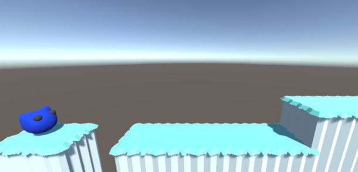

# GMTK 2021 Game Jam Practice

To develop a creative and enjoyable **game in 48 hours** is the goal in the [Game Maker's Toolkit's Game Jam](https://itch.io/jam/gmtk-jam-2022).

This year I want to participate, so I am practicing with last year's theme: **"Joined Together"**.  
The game will be made with Unity.

## Still in progress

* ~~Music~~
* Animations
* 2nd level
* ~~Winning screen~~
* Publishing the game

## The game

A platformer with puzzle mechanics in a nature setting.

### How to run

Clone. Download the assets from below.
Place the missing fbx files in their place. Then the game should build.  
It uses Unity 2021.3.4f1.

## Assets

* 3D models: https://www.kenney.nl/assets/nature-kit
* Background: https://www.kenney.nl/assets/background-elements
* Player and friend: made in [Blender](https://www.blender.org/) by me
* Music made in [BeepBox](https://www.beepbox.co/) by me

## Lessons learned

1. Coming up with an idea is easier and faster than thought.
1. Creating a working idea is hard without prototyping or thinking early about the details.
That is because you need to consider what is possible to implement with your current knowledge.
1. Using pre-made assets saves a lot of time.
1. Level building requires a lot of effort. Even with pre-made assets ready.
1. Creating a simple character model can be fast.
1. Carefully consider if you need a Character Controller, Rigidbody or none of both to implement movement.
1. On the first day focus on creating a valid concept and a working prototype. No nice-to-have code or graphics.
1. 48 hours pass fast when you take long breaks...
