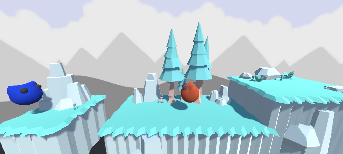

# GMTK 2021 Game Jam Practice

To develop a creative and enjoyable **game in 48 hours** is the goal in the [Game Maker's Toolkit's Game Jam](https://itch.io/jam/gmtk-jam-2022).

This year I want to participate, so I am practicing with last year's theme: **"Joined Together"**.  
The game will be made with Unity.

## The game

A platformer with puzzle mechanics in a nature setting.

## Assets

3D models: https://www.kenney.nl/assets/nature-kit  
Background: https://www.kenney.nl/assets/background-elements
